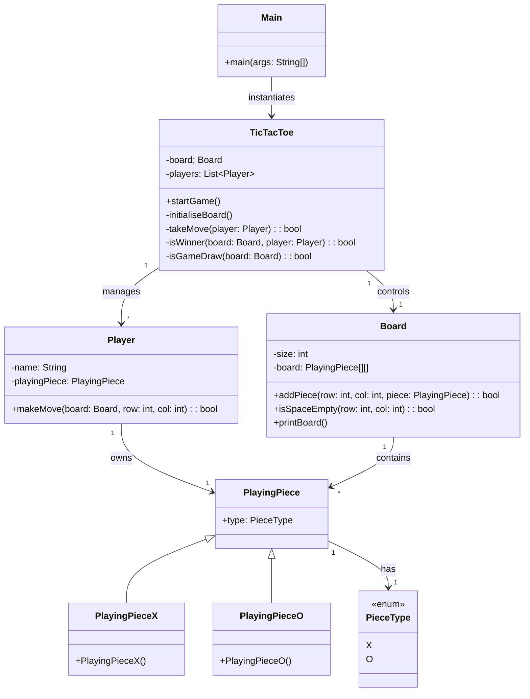

# 🚀 Low-Level Design: Tic-Tac-Toe

## Short Description
Dive into the world of Object-Oriented Programming (OOP) with this meticulously crafted Tic-Tac-Toe game. This project serves as a prime example of applying core low-level design principles, showcasing clean architecture, modular components, and extensible code for a classic console-based gaming experience. Perfect for understanding how to translate real-world concepts into robust software design.

## 🛡️ Project Health & Status
This project is a well-structured and runnable prototype, demonstrating robust OOP principles. It's stable for demonstration and serves as an excellent foundation for further exploration into low-level design patterns.

## ✨ Key Features
*   **Classic Game Logic:** Fully functional Tic-Tac-Toe game adherence to traditional rules.
*   **Modular OOP Design:** Clear separation of concerns with dedicated classes for `Board`, `Player`, `PlayingPiece`, and game orchestration.
*   **Extensible Piece Types:** Easily add new playing pieces (e.g., a "blocking" piece) with minimal code changes.
*   **Console-Based Interface:** Simple and intuitive command-line interaction for gameplay.
*   **Winner & Draw Detection:** Robust logic to determine game outcomes.

## Who is this for?
This project is ideal for:
*   Software Developers seeking practical examples of low-level design patterns.
*   Students learning Object-Oriented Programming (OOP) in Java.
*   Anyone interested in understanding how to build a simple game from scratch with good software engineering practices.
*   Interviewees preparing for system design or LLD interviews.

## Technology Stack & Architecture
*   **Core Language:** Java
*   **Build Tool:** Apache Maven

## 📊 Architecture & Database Schema
The project leverages a classic MVC-like separation, with `Main` and `TicTacToe` acting as the controller/orchestrator, and a robust `Model` layer defining game entities.



## ⚙️ Configuration & Deployment
This project is a standalone Java application built with Maven. No external configurations or deployments are strictly necessary beyond a Java Development Kit (JDK) and Maven.

## ⚡ Quick Start Guide
To get the Tic-Tac-Toe game up and running locally, follow these simple steps:

1.  **Clone the repository:**
    ```bash
    git clone https://github.com/grewal16/low_level_design.git
    cd low_level_design/TicTacToe
    ```
2.  **Build the project using Maven:**
    ```bash
    mvn clean install
    ```
3.  **Run the compiled JAR file:**
    ```bash
    java -jar target/TicTacToe-1.0-SNAPSHOT.jar
    ```
    Follow the prompts in your console to play the game!