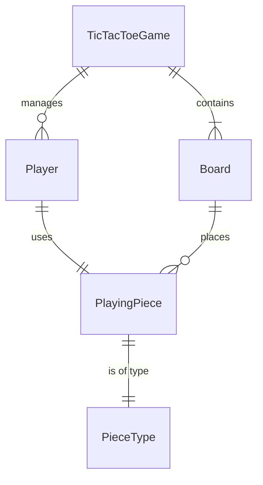

# 🚀 TicTacToe Game

## Short Description
Dive into a meticulously crafted implementation of the classic Tic-Tac-Toe game, engineered with robust Low-Level Design (LLD) principles in Java. This project serves as an excellent reference for building scalable, maintainable, and object-oriented software solutions from the ground up.

## 🛡️ Project Health & Status
This TicTacToe implementation is functional and ready for execution. It's a complete, self-contained demonstration of core game logic, showcasing clean architecture and design patterns. While focused on core LLD, it provides a solid foundation for further expansion or integration.

## ✨ Key Features
*   **Object-Oriented Design:** Experience a clean, modular structure with distinct classes for `Board`, `Player`, `PlayingPiece`, and game orchestration.
*   **Extensible Game Logic:** Designed for easy modification and extension, allowing for future enhancements like AI opponents or different board sizes.
*   **Clear Separation of Concerns:** Core game mechanics are isolated in logical units, making the codebase easy to understand and maintain.
*   **Player & Piece Management:** Robust handling of players, their unique playing pieces (X and O), and turns.
*   **Comprehensive Board State Tracking:** Efficiently manages the game board, checks for winning conditions, and identifies draw scenarios.

## Who is this for?
*   **Aspiring Software Developers:** Learn by example how to apply LLD concepts to a real-world problem.
*   **Interview Preparation:** Ideal for practicing and understanding common system design questions related to game development.
*   **Java Enthusiasts:** Explore well-structured Java code for building console-based applications.
*   **Educators:** A perfect, ready-to-use example for teaching object-oriented programming and design principles.

## Technology Stack & Architecture
This project is built entirely in **Java**, leveraging **Maven** for dependency management and project automation. It's a testament to powerful, standalone applications achievable with a pure Java stack.

## 📊 Architecture & Database Schema
The core of the TicTacToe game is built around a clear object model, establishing well-defined relationships between key game entities.



## ⚙️ Configuration & Deployment
This project requires a Java Development Kit (JDK) (version 8 or higher is recommended) and Apache Maven to be installed on your system. No complex configurations or external services are needed.

## ⚡ Quick Start Guide

To get this TicTacToe game up and running, follow these simple steps:

1.  **Clone the Repository:**
    ```bash
    git clone https://github.com/grewal16/low_level_design.git
    cd low_level_design/TicTacToe
    ```
2.  **Build the Project:**
    Use Maven to compile the source code and package it into an executable JAR.
    ```bash
    mvn clean install
    ```
3.  **Run the Game:**
    Execute the compiled JAR file.
    ```bash
    java -jar target/TicTacToe-1.0-SNAPSHOT.jar
    ```
    The game will start in your console, prompting players for their moves.