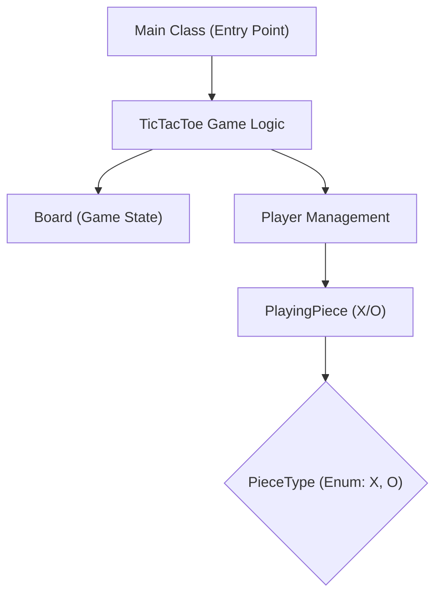

# 🚀 TicTacToe Low-Level Design Project

## Short Description
Dive into the classic game of Tic-Tac-Toe reimagined with a robust and extensible low-level design. This project showcases a clean, object-oriented implementation of the game, built entirely in Java, emphasizing modularity, clear separation of concerns, and fundamental design principles. It's a perfect learning resource for understanding how to break down a common problem into well-defined components.

## 🛡️ Project Health & Status
This project is stable and fully functional, demonstrating a complete implementation of the Tic-Tac-Toe game. It's ready for immediate use and serves as an excellent foundation for further enhancements or as a learning tool.

## ✨ Key Features
*   **Object-Oriented Design:** A clear, class-based structure for `Board`, `Player`, `PlayingPiece`, and game logic.
*   **Modular Architecture:** Easily understandable components that can be extended or modified independently.
*   **Player & Piece Abstraction:** Support for multiple players, each with distinct playing pieces (X or O).
*   **Game State Management:** Robust handling of game turns, move validation, and win/draw condition detection.
*   **Command-Line Interface:** An interactive console experience to play the game.

## Who is this for?
This project is ideal for:
*   Software developers looking to sharpen their low-level design skills.
*   Students learning object-oriented programming (OOP) and design patterns in Java.
*   Anyone seeking a clear, practical example of how to structure a simple game application from the ground up.

## Technology Stack & Architecture
This project is built using:
*   **Core Language:** Java
*   **Build Tool:** Apache Maven

## 📊 Architecture & Database Schema
This project follows a clear object-oriented application structure. Below is a high-level flowchart illustrating the main components and their interactions:



## ⚙️ Configuration & Deployment
This project is a standard Maven-based Java application. There are no complex external configurations or dependencies beyond a Java Development Kit (JDK) and Maven.

## ⚡ Quick Start Guide
To get this Tic-Tac-Toe project up and running:

1.  **Clone the repository:**
    ```bash
    git clone https://github.com/grewal16/low_level_design.git
    cd low_level_design/TicTacToe
    ```
2.  **Build the project using Maven:**
    ```bash
    mvn clean install
    ```
3.  **Run the application:**
    ```bash
    java -jar target/TicTacToe-1.0-SNAPSHOT.jar
    ```
    Follow the on-screen prompts to start playing Tic-Tac-Toe!