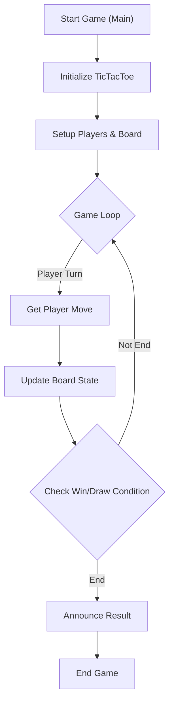

# 🚀 Low-Level Design

<p align="center">
    <a href="https://github.com/grewal16/low_level_design/stargazers"></a>
    <a href="https://github.com/grewal16/low_level_design/network/members"></a>
    <a href="https://github.com/grewal16/low_level_design/issues"></a>
</p>

## Short Description
Welcome to the `Low-Level Design` repository – a meticulously crafted collection showcasing practical implementations of fundamental software design principles. This project aims to demystify complex design patterns and object-oriented concepts through clear, functional examples. Kickstarting this collection is a robust, command-line based Tic-Tac-Toe game, built with a strong emphasis on modularity, extensibility, and clean code.

## 🛡️ Project Health & Status
This repository is in active development, currently featuring a well-structured and functional implementation of the classic Tic-Tac-Toe game. It serves as a foundational example, demonstrating robust low-level design principles in action. While comprehensive test suites are planned for future iterations, the existing code is stable and ready for exploration and further expansion.

## ✨ Key Features
*   **Object-Oriented Design:** A clear and intuitive class structure, modeling game entities like `Board`, `Player`, `PlayingPiece`, and `PieceType`.
*   **Modular Game Logic:** Separated concerns ensure game rules, player interactions, and board state management are distinct and manageable.
*   **Extensible Piece & Player Types:** Easily add new playing piece types or player behaviors without extensive code modifications.
*   **Command-Line Interface:** Engage with the Tic-Tac-Toe game directly from your terminal, providing a straightforward user experience.

## Who is this for?
This project is ideal for:
*   **Aspiring Software Engineers:** Learn how to translate high-level requirements into clean, maintainable code.
*   **Students & Self-Learners:** Grasp core object-oriented programming (OOP) and low-level design (LLD) concepts through practical application.
*   **Interview Preparation:** A hands-on example to understand and discuss design choices for common interview questions.
*   **Experienced Developers:** A quick reference or a starting point for exploring various design approaches.

## Technology Stack & Architecture
This project is primarily built using:
*   **Java:** The core programming language, leveraging its strong OOP capabilities.
*   **Maven:** Used as the build automation tool, managing dependencies and project lifecycle.

## 📊 Architecture & Database Schema
The Tic-Tac-Toe game follows a clear separation of concerns, with distinct components managing game state, player actions, and the game board. The architecture prioritizes modularity, making it easy to understand and extend.



## ⚙️ Configuration & Deployment
This project is configured as a standard Maven project. Building and running it requires a Java Development Kit (JDK) and Maven to be installed on your system. No complex environment variables or external services are needed.

## ⚡ Quick Start Guide
Follow these simple steps to get the Tic-Tac-Toe game up and running on your local machine:

1.  **Clone the Repository:**
    ```bash
    git clone https://github.com/grewal16/low_level_design.git
    cd low_level_design/TicTacToe
    ```

2.  **Build the Project:**
    Navigate into the `TicTacToe` directory and use Maven to compile the source code and package it into an executable JAR.
    ```bash
    mvn clean install
    ```

3.  **Run the Game:**
    Execute the compiled JAR file.
    ```bash
    java -jar target/TicTacToe-1.0-SNAPSHOT.jar
    ```
    The game will start in your console, prompting players for moves.