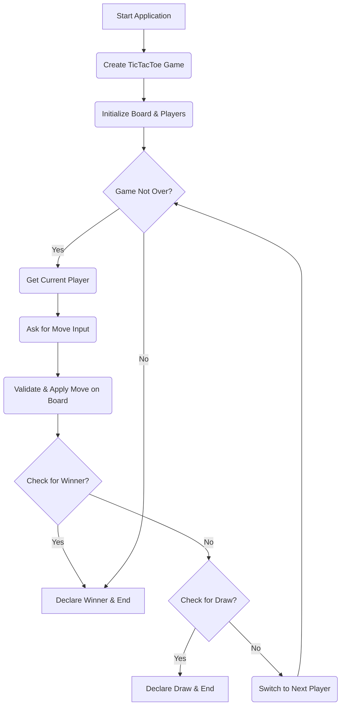

# 🚀 TicTacToe Game (Low-Level Design)

## Short Description
Dive into the classic game of Tic-Tac-Toe, meticulously crafted with a focus on robust Low-Level Design (LLD) principles! This project presents a clean, modular, and extensible Java implementation of the beloved two-player game, showcasing object-oriented design patterns and best practices. It's an ideal learning resource for mastering fundamental software design concepts through a practical, engaging example.

## 🛡️ Project Health & Status
This project represents a solid foundational implementation of the Tic-Tac-Toe game, demonstrating a clear and functional design. Built with modularity in mind, it's a stable and ready-to-use example, perfect for learning or as a base for further enhancements. While not incorporating explicit CI/CD or comprehensive unit tests in this version, the code structure inherently promotes maintainability and allows for easy integration of testing frameworks.

## ✨ Key Features
*   **Object-Oriented Design:** Clear separation of concerns with dedicated classes for `Board`, `Player`, `PlayingPiece`, and game logic.
*   **Flexible Player Management:** Supports multiple players with distinct pieces (X and O).
*   **Dynamic Game State:** Manages turns, validates moves, and updates the board in real-time.
*   **Comprehensive Win/Draw Logic:** Intelligently detects win conditions (rows, columns, diagonals) and draws.
*   **Extensible Architecture:** Designed to be easily modified or extended for new game rules, AI players, or different board sizes.
*   **Command-Line Interface:** Simple and intuitive text-based interaction for gameplay.

## Who is this for?
*   **Aspiring Software Engineers:** Perfect for understanding core LLD concepts in a practical setting.
*   **Java Developers:** A great example of clean Java code, object-oriented programming, and design patterns.
*   **Interview Preparation:** An excellent resource for practicing common system design questions related to game development.
*   **Educators & Students:** An illustrative project for teaching software architecture and design principles.

## Technology Stack & Architecture
This project is built using battle-tested and widely adopted technologies:
*   **Primary Language:** Java
*   **Build Tool:** Apache Maven (`pom.xml`) for dependency management and project compilation.

## 📊 Architecture & Database Schema
The Tic-Tac-Toe game follows a clear, layered architecture, emphasizing separation of concerns. The core game logic resides in the `TicTacToe` class, orchestrating interactions between players and the `Board` model. There is no database schema as this is a purely in-memory game. The primary flow involves players taking turns, making moves on the board, and the game checking for win or draw conditions.



## ⚙️ Configuration & Deployment
This project is self-contained and requires no complex configuration. Maven handles all dependencies. The output is a standard Java executable JAR.

## ⚡ Quick Start Guide
Get the Tic-Tac-Toe game up and running in minutes!

1.  **Clone the Repository:**
    ```bash
    git clone https://github.com/grewal16/low_level_design.git
    cd low_level_design/TicTacToe
    ```
2.  **Build the Project:**
    Use Maven to compile the source code and package it into an executable JAR.
    ```bash
    mvn clean install
    ```
3.  **Run the Game:**
    Execute the generated JAR file from the `target` directory.
    ```bash
    java -jar target/TicTacToe-1.0-SNAPSHOT.jar
    ```
    Follow the on-screen prompts to play the game!