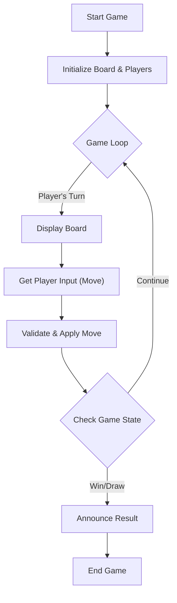

# 🚀 Tic Tac Toe: A Low Level Design Example

## Short Description
Dive into the foundational principles of object-oriented design with this classic Tic Tac Toe game implementation. This project serves as a clear, concise example of Low-Level Design (LLD), demonstrating how to structure a simple application for maintainability, extensibility, and clarity using modern Java practices. Perfect for developers looking to grasp core design patterns in a practical context.

## 🛡️ Project Health & Status
This project is a functional, self-contained demonstration of Low-Level Design principles. It is considered a complete prototype, designed for educational purposes and immediate utility. While comprehensive automated test suites are not included, the codebase is stable and ready for exploration and extension.

## ✨ Key Features
*   **Clean Object-Oriented Design:** Experience a well-structured codebase adhering to SOLID principles.
*   **Modular Game Components:** Clearly defined classes for `Board`, `Player`, `PlayingPiece`, and `Game` facilitate understanding and modification.
*   **Turn-Based Gameplay:** Implements the core logic for managing player turns and moves.
*   **Win/Draw Condition Detection:** Intelligent logic to determine game outcomes.
*   **Console-Based Interface:** A straightforward command-line interface for interactive gameplay.
*   **Extensible Piece Types:** Easy to add new piece types or game variations.

## Who is this for?
*   **Aspiring Software Developers:** Learn best practices for structuring code from the ground up.
*   **Interview Preparation:** A hands-on example to solidify your understanding of Low-Level Design questions.
*   **Java Enthusiasts:** Explore a practical application of Java in a simple game development context.
*   **Educators:** A ready-to-use example for teaching object-oriented design.

## Technology Stack & Architecture
This project is built using a robust and widely adopted technology stack, ensuring clarity and broad accessibility:

*   **Language:** Java
*   **Build Tool:** Apache Maven

## 📊 Architecture & Database Schema
This project's architecture focuses on an in-memory game state, emphasizing the interaction between core game components. The flow outlines a typical turn-based game loop.



## ⚙️ Configuration & Deployment
This project is a standard Maven-based Java application. No complex external configurations or infrastructure setups are required.

## ⚡ Quick Start Guide
Get the Tic Tac Toe game up and running in a few simple steps:

1.  **Clone the Repository:**
    ```bash
    git clone https://github.com/grewal16/low_level_design.git
    cd low_level_design/TicTacToe
    ```
2.  **Build the Project:**
    Use Maven to compile the source code and package it into an executable JAR file.
    ```bash
    mvn clean install
    ```
3.  **Run the Game:**
    Execute the generated JAR file from the `target` directory.
    ```bash
    java -jar target/TicTacToe-1.0-SNAPSHOT.jar
    ```
    Follow the on-screen prompts to play the game!