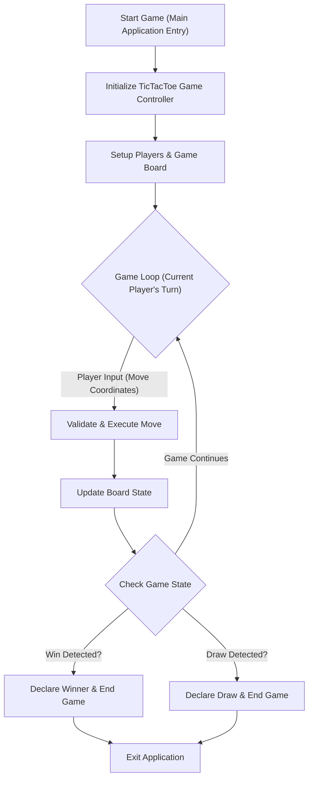

# 🚀 low_level_design

<p align="center">
    <a href="https://github.com/grewal16/low_level_design/stargazers"></a>
    <a href="https://github.com/grewal16/low_level_design/network/members"></a>
    <a href="https://github.com/grewal16/low_level_design/issues"></a>
</p>

## Short Description
Dive into the foundational principles of Low-Level Design (LLD) with this classic Java implementation of Tic-Tac-Toe. This project serves as a robust example of object-oriented design, demonstrating how to structure a simple game with clear responsibilities, maintainable code, and extensible architecture. It's an excellent resource for understanding core LLD concepts through a practical, interactive application.

## 🛡️ Project Health & Status
This project presents a stable and functional implementation of the Tic-Tac-Toe game. It is a fully working prototype, ready for demonstration and study, showcasing a complete game loop from setup to win/draw conditions.

## ✨ Key Features
*   **Classic Tic-Tac-Toe Gameplay:** Implements the standard 3x3 (or N*N extensible) grid game logic.
*   **Two-Player Interactive Experience:** Supports two human players taking turns to place their marks.
*   **Robust Win Condition Logic:** Accurately detects horizontal, vertical, and diagonal wins.
*   **Draw Condition Handling:** Correctly identifies when a game results in a draw.
*   **Object-Oriented Design:** Clear separation of concerns using classes for Board, Player, and Playing Pieces, promoting reusability and maintainability.
*   **Extensible Architecture:** Designed to be easily adaptable for different board sizes or game variations.

## Who is this for?
This project is an invaluable resource for:
*   **Software Developers:** Looking to sharpen their Low-Level Design (LLD) skills.
*   **Interview Candidates:** Preparing for system design or LLD rounds, seeking practical examples.
*   **Java Enthusiasts:** Interested in applying OOP principles to build simple game logic.
*   **Students:** Learning about game development fundamentals and software architecture.

## Technology Stack & Architecture
This project is built using the robust and widely adopted Java ecosystem:
*   **Core Language:** Java
*   **Build Tool:** Apache Maven
*   **Architecture:** Adheres to a clean Object-Oriented Design (OOD) paradigm, promoting modularity and abstraction for game components.

## 📊 Architecture & Database Schema
The Tic-Tac-Toe game follows a clear, sequential flow driven by player interaction and game state management.



## ⚙️ Configuration & Deployment
This project has minimal configuration requirements and is ready to run as a standalone Java application. It leverages Maven for dependency management and building.

## ⚡ Quick Start Guide
Get the Tic-Tac-Toe game up and running in a few simple steps:

1.  **Clone the Repository:**
    ```bash
    git clone https://github.com/grewal16/low_level_design.git
    cd low_level_design/TicTacToe
    ```
2.  **Build the Project with Maven:**
    ```bash
    mvn clean install
    ```
3.  **Run the Game:**
    ```bash
    java -jar target/TicTacToe-1.0-SNAPSHOT.jar
    ```
    Follow the on-screen prompts to play the game!