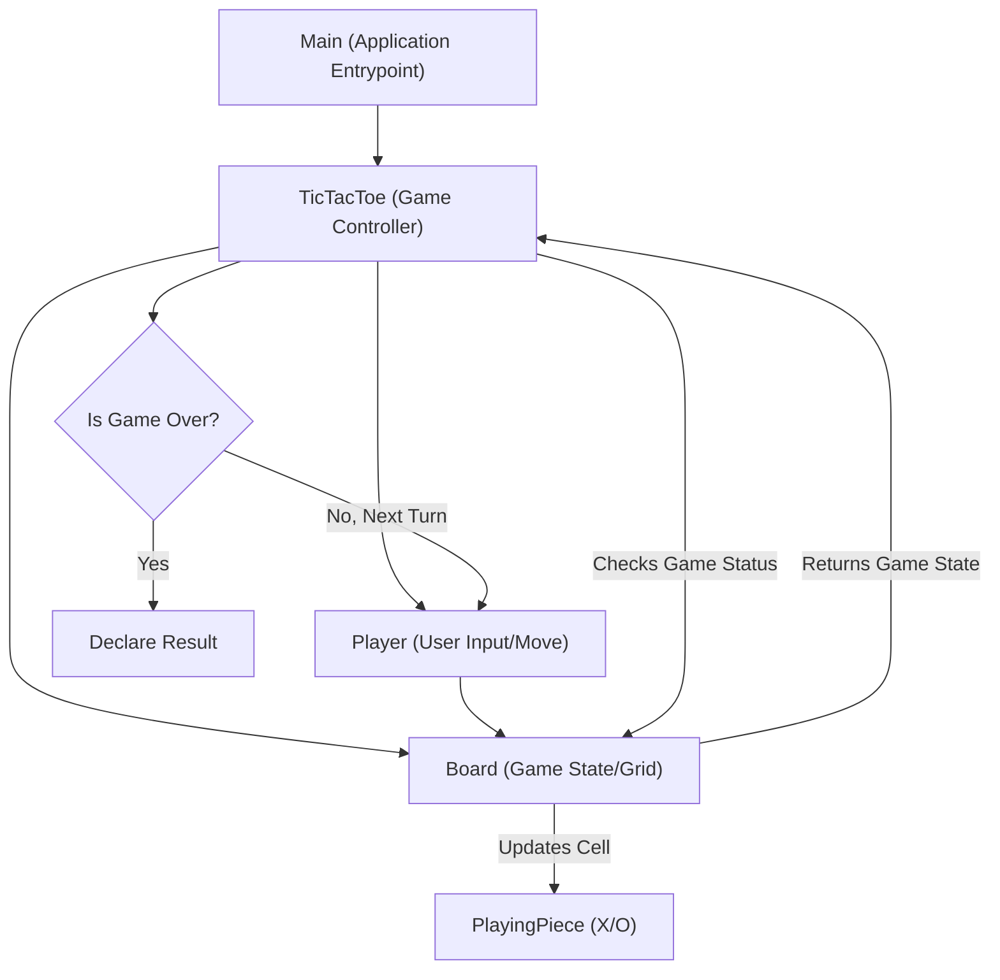

# 🚀 Low-Level Design Examples

<p align="center">
    <a href="https://github.com/grewal16/low_level_design/stargazers"></a>
    <a href="https://github.com/grewal16/low_level_design/network/members"></a>
    <a href="https://github.com/grewal16/low_level_design/issues"></a>
</p>

## Short Description
Dive deep into the art of software engineering with the **Low-Level Design Examples** repository! This project serves as a practical showcase for implementing fundamental object-oriented design principles through well-structured, maintainable code. Currently, it features a robust and extensible **Tic-Tac-Toe** game implementation, meticulously crafted to demonstrate core LLD concepts in action. It's the perfect resource for dissecting how complex systems can be broken down into manageable, interacting components.

## 🛡️ Project Health & Status
This repository hosts stable and functional demonstrations of low-level design patterns. The included Tic-Tac-Toe project is a complete, self-contained application, ready for immediate compilation and execution. While dedicated automated test suites are not yet explicitly integrated, the codebase is designed for clarity and maintainability, ensuring high functional integrity. It's an excellent foundation for active learning and further enhancement.

## ✨ Key Features
*   **Object-Oriented Tic-Tac-Toe:** A fully playable command-line Tic-Tac-Toe game, illustrating classic game logic.
*   **Modular Design:** Clearly separated concerns with dedicated classes for `Board`, `Player`, `PlayingPiece`, and game logic (`TicTacToe`) for enhanced readability and maintainability.
*   **Extensible Architecture:** Designed to easily introduce new game pieces, players, or even variations of rules without significant refactoring.
*   **Clean Code Principles:** Exemplifies best practices for class design, encapsulation, abstraction, and polymorphism.
*   **Maven-Driven Build:** Standardized project structure and build process using Apache Maven, ensuring ease of setup and deployment.

## Who is this for?
This repository is an invaluable asset for:
*   **Aspiring Software Engineers:** Learn how to translate high-level requirements into detailed, object-oriented designs.
*   **Interview Preparation:** Practice and understand common low-level design interview questions with a concrete, hands-on example.
*   **Java Developers:** Explore well-structured Java code that adheres to industry best practices and design patterns.
*   **Educators:** Utilize as a teaching aid for demonstrating fundamental OOD concepts in a practical setting.

## Technology Stack & Architecture
This project is built with a focus on core Java development practices, demonstrating robust, platform-independent application design.
*   **Core Language:** Java
*   **Build Automation:** Apache Maven
*   **Paradigm:** Object-Oriented Programming (OOP)

The architecture emphasizes a clear separation of concerns, utilizing distinct classes for game entities and logic to create a flexible, scalable, and maintainable system.

## 📊 Architecture & Database Schema
The Tic-Tac-Toe game demonstrates a classic Model-View-Controller (MVC) pattern-like separation, focusing heavily on the Model and Controller aspects within a command-line interface.



## ⚙️ Configuration & Deployment
The project is configured using Maven, providing a standard and straightforward build process. No complex environment variables or external services are required beyond a Java Development Kit (JDK).

To set up the project:
1.  Ensure you have **Java Development Kit (JDK) 8 or higher** installed.
2.  Ensure you have **Apache Maven 3.x or higher** installed.

## ⚡ Quick Start Guide
Get the Tic-Tac-Toe game up and running in no time!

1.  **Clone the repository:**
    ```bash
    git clone https://github.com/grewal16/low_level_design.git
    cd low_level_design/TicTacToe
    ```
2.  **Build the project using Maven:**
    ```bash
    mvn clean install
    ```
3.  **Run the Tic-Tac-Toe game:**
    ```bash
    java -jar target/TicTacToe-1.0-SNAPSHOT.jar
    ```
    Follow the prompts in your console to play!