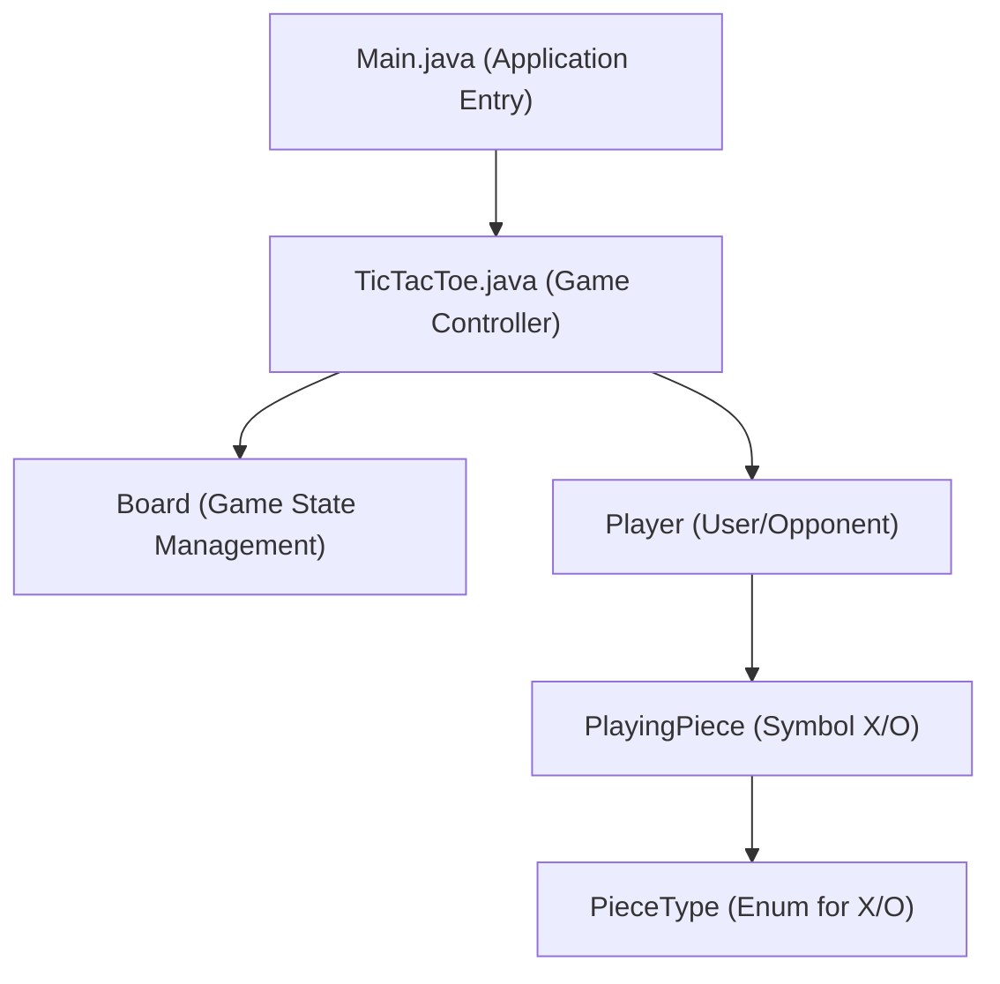

# 🚀 low_level_design - TicTacToe Example

<p align="center">
    <a href="https://github.com/grewal16/low_level_design/stargazers"></a>
    <a href="https://github.com/grewal16/low_level_design/network/members"></a>
    <a href="https://github.com/grewal16/low_level_design/issues"></a>
</p>

## Short Description

Dive into the foundational principles of software architecture with the **TicTacToe Low-Level Design** project! This repository showcases a meticulously crafted, object-oriented implementation of the classic Tic-Tac-Toe game in Java. It serves as an exceptional educational resource for understanding core low-level design patterns, SOLID principles, and clean code practices in action, providing a clear blueprint for building robust, extensible applications from the ground up.

## 🛡️ Project Health & Status

This project is a functional, self-contained prototype demonstrating robust low-level design concepts. While not configured for continuous integration, its clear structure and complete implementation make it a stable and ready-to-explore educational resource. It is fully operational and serves as an excellent reference for anyone looking to understand practical OOD.

## ✨ Key Features

*   **Pure Object-Oriented Design:** A clean separation of concerns with distinct classes for `Board`, `Player`, `PlayingPiece`, and game logic.
*   **Extensible Architecture:** Designed to be easily adaptable for future enhancements, such as different game modes or AI players.
*   **Clear Game Flow:** Implements turn-based gameplay, move validation, and comprehensive win condition checks.
*   **Educational Focus:** Provides a hands-on example of how to apply design patterns for a simple yet effective system.

## Who is this for?

This project is an invaluable asset for:

*   **Aspiring Software Developers:** Learn by example how to approach low-level design problems.
*   **Computer Science Students:** Reinforce theoretical knowledge of object-oriented programming with practical application.
*   **Interview Preparation:** A perfect case study for understanding and explaining LLD concepts.
*   **Anyone Curious about Game Development:** See the inner workings of a classic game from an architectural perspective.

## Technology Stack & Architecture

This project is built using:

*   **Core Language:** Java
*   **Build Tool:** Apache Maven

The architecture employs fundamental Object-Oriented Programming (OOP) principles, with a clear separation between game logic, data models, and player representation.

## 📊 Architecture & Database Schema

The core architecture of the TicTacToe game is designed for clarity and extensibility, emphasizing the interaction between key components:



## ⚙️ Configuration & Deployment

This project is configured using Maven, simplifying dependency management and the build process. No external services or complex configurations are required.

## ⚡ Quick Start Guide

Get the TicTacToe game up and running in a few simple steps:

1.  **Clone the Repository:**
    ```bash
    git clone https://github.com/grewal16/low_level_design.git
    cd low_level_design/TicTacToe
    ```
2.  **Build the Project with Maven:**
    ```bash
    mvn clean install
    ```
3.  **Run the Game:**
    ```bash
    java -jar target/TicTacToe-1.0-SNAPSHOT.jar
    ```
    Follow the on-screen prompts in your terminal to play the game!